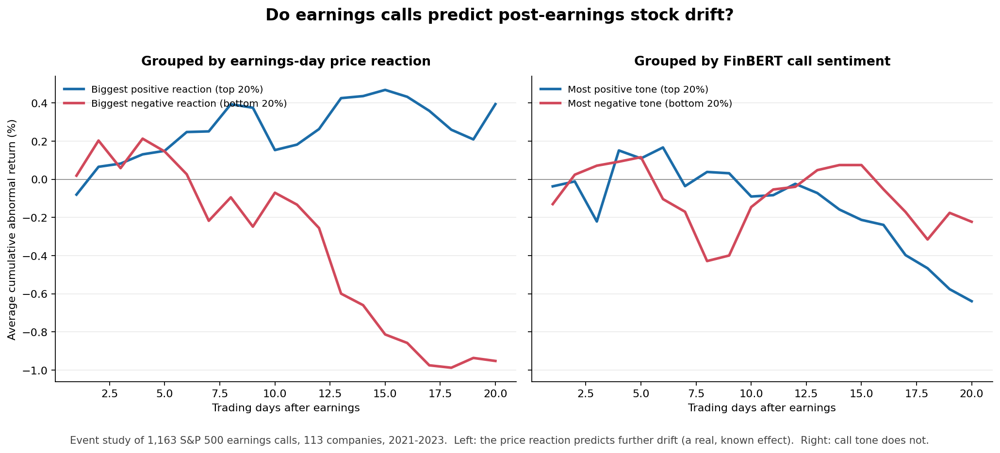

# Do Earnings-Call Tone Predict Stock Returns?

An NLP + event-study test of a popular idea: **can you trade on the *tone* of a company's earnings call?** Built end to end — transcript data, FinBERT sentiment scoring, and a market-model event study — across **1,163 S&P 500 earnings calls (2021–2023)**.



## The finding

- **The earnings-day price reaction predicts the next month of drift** (left panel) — the well-documented *post-earnings-announcement drift*. The pipeline recovers this known effect from scratch, which validates the method.
- **Call sentiment does not** (right panel). After accounting for the market's immediate reaction to the numbers, FinBERT tone adds no predictive power. In large, heavily-covered stocks, tone is priced in the moment it's spoken.

The honest takeaway: the appealing "trade the tone" signal isn't there in large caps — and the value of the project is testing that rigorously (cost-aware, confound-controlled) rather than pretending otherwise.

## Method

Sentiment is scored per transcript with FinBERT as `P(positive) − P(negative)`, chunked to handle length and split into prepared remarks vs. Q&A. Because calls happen after the close, the first tradeable day is the next open, so the test is on the post-earnings *drift*. Abnormal returns come from a market-model event study (estimation window −250..−30; event windows [+1,+5] and [+1,+20]). The key test regresses each stock's drift on its call sentiment **while controlling for the announcement-day price reaction** — i.e. does tone add anything beyond the market's read of the numbers? Standard errors are clustered by quarter, and the long/short portfolio is reported net of transaction costs.

## Run it

```bash
pip install -r requirements.txt
python demo_synthetic.py      # offline demo, proves the engine works (no data needed)
python run_pipeline.py        # the real study, end to end -> regenerates the chart
```

No API key required: transcripts come from the free Hugging Face dataset
`kurry/sp500_earnings_transcripts`; prices from `yfinance`. See **RUNBOOK.md** for
click-by-click setup, including a zero-install Google Colab path.

## Tech

Python · Hugging Face Transformers (FinBERT) · statsmodels · yfinance · pandas · matplotlib

## Limitations

- **S&P 500 only** — does not test smaller, less-covered names where slower information diffusion could plausibly leave a signal.
- Controls for the announcement-day **price reaction as a proxy** for the earnings surprise, not actual EPS estimates.
- Single **2021–2023** regime; ~113 companies after delistings (e.g. SVB, First Republic dropped out).
- FinBERT was trained on financial **news**, not conversational Q&A — a domain gap.

## Repo layout

```
src/fetch_data.py       transcripts (HF dataset) + prices (yfinance) -> data/raw
src/score_sentiment.py  FinBERT scoring -> sent_full, sent_qa, sent_delta
src/align_returns.py    t0 alignment + market-model reaction / CAR / path
src/event_study.py      abnormal returns, CAR
src/backtest.py         standardization, regressions, quintile long/short
analyze.py              surprise-residual test + the chart above
run_pipeline.py         one command: fetch -> score -> align -> analyze
demo_synthetic.py       offline end-to-end demo with a planted signal
```
